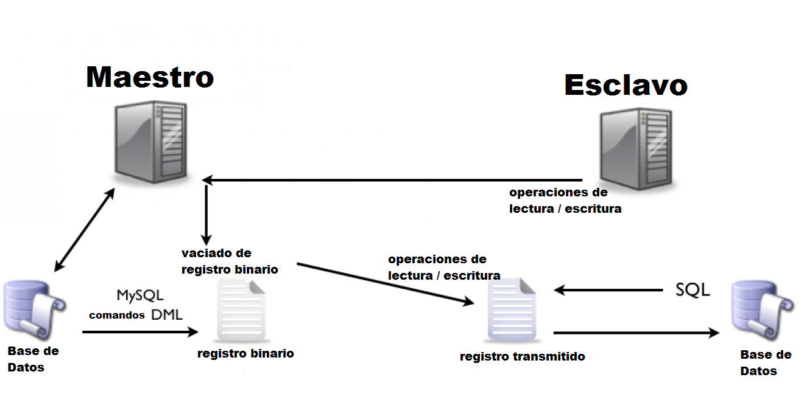

#patrones arquitectonicos
> [!NOTE]
> 👍Un **patron arquitectonicos** es una solucion general y reutilizable a un programa comun en la arquitectura de  software
 dentro de un texto dado. los patrones
 arquitectonicos son la habilidad de la organizacion a nivel de carpetas dentro del proyecto de software.

 PATRONES  ARQUITECTONICOS MAS CONOCIDOS 

1. PATRON DE CAPAS
2. PATRON DE CLIENTES - SERVIDOR
3. PATRON MAESTRO-ESCLAVO
4. PATRON FILTRO DE TUBERIA
5. PATRON DE INTERMEDIARIO
6. PATRON DE IGUAL A IGUAL
7. PATRON DE BUS EVENTO
8. MODELO-VISTA-CONTROLADOR
9. ARQUITECTURA LIMPIA
10. ARQUITECTURA HEXAGONAL

## PATRON MAESTRO-ESCLAVO

## INTRODUCCION
 El patrón Maestro / Esclavo se usa más comúnmente cuando se responde a los controles de la interfaz de usuario mientras se recopilan datos simultáneamente. Suponga que desea escribir una aplicación que mida y registre un voltaje que cambia lentamente una vez cada cinco segundos.
 # FUNCION
 Patrón Maestro-Esclavo, elaboración propia. Este patrón puede utilizarse para estructurar sistemas que producen y procesan un flujo de datos. Cada paso de procesamiento está encerrado dentro de un componente de filtro. Los datos que se van a procesar pasan a través de tuberías.

## 쯇or qué utilizar Maestro/Esclavo?

El patrón de diseño Maestro/Esclavo es muy ventajoso cuando creamos aplicaciones multi-tarea. Le da un enfoque más modular al desarrollo de la aplicación debido a su funcionalidad multi-bucle, pero más importante, le da un mejor control de la gestión de tiempo en su aplicación. Cada bucle paralelo es tratado como una tarea o hilo separado. Un hilo se define como la parte de un programa que se puede ejecutar independientemente de las otras partes. Si tiene una aplicación que no utiliza hilos separados, esa aplicación se interpreta por el sistema como un hilo. Cuando separa su aplicación en múltiples hilos, cada uno comparte el tiempo de procesamiento por igual entre ellos.

# VENTAJAS Y DESVENTAJAS DE PATRON DE MAESTRO/ESCLAVO

 # VENTAJAS
 El patrón de diseño maestro / esclavo es muy ventajoso al crear aplicaciones multitarea. Le brinda un enfoque más modular para el desarrollo de aplicaciones debido a su funcionalidad de bucle múltiple, pero lo más importante es que le brinda más control de la administración del tiempo de su aplicación.

 

# DESVENTAJAS

La principal desventaja es que puesto que el patrón de diseño Maestro-Esclavo no está basado en sincronización, por ello es posible que el bucle esclavo inicie su ejecución primero que el bucle maestro.

# DEFINICION

El patrón de diseño Maestro / Esclavo es otra arquitectura fundamental que usan los desarrolladores de LabVIEW. Se utiliza cuando tiene dos o más procesos que deben ejecutarse de forma simultánea y continua, pero a diferentes velocidades.
